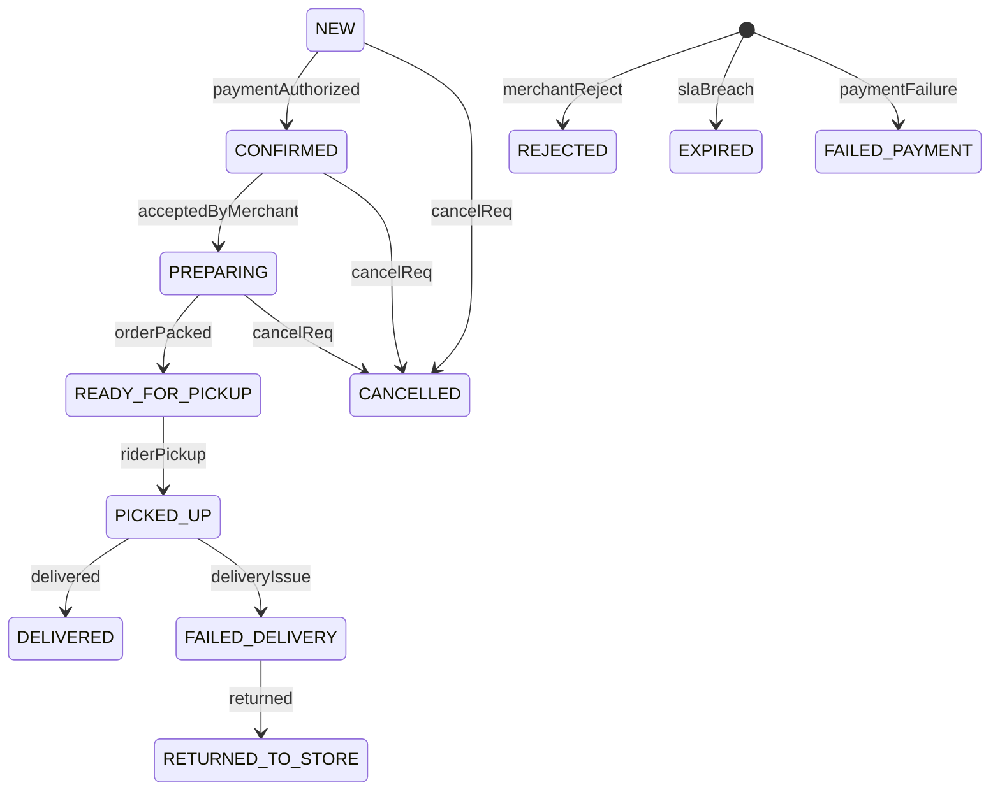

# Product‑Requirements Document  
**Order‑Management Micro‑service**  
Version 1.0 — Final

---

## 1 · Executive Summary
The Order‑Management service orchestrates the complete lifecycle of food‑delivery orders, acting as the bridge between **customers**, **merchants**, **riders**, and the **Payments** and **Notification** services. It exposes deterministic REST APIs, publishes state–change events, and enforces SLAs through an internal state machine.

---

## 2 · Goals & KPIs

| Goal | KPI |
|------|-----|
| G1 — Fast confirmation | P95 _NEW→CONFIRMED_ < 5 min |
| G2 — Integrity | 0 invalid state transitions / week |
| G3 — Event completeness | 100 % state changes published to RabbitMQ |
| G4 — Performance | P99 latency < 150 ms at 300 TPS |

---

## 3 · Scope

| In Scope | Out of Scope |
|----------|--------------|
| Order capture and status orchestration | Payment processing logic |
| REST APIs for customer, merchant, rider clients | Rider geo‑tracking |
| Saga coordination via RabbitMQ events | Analytics warehousing |
| OrderStatusHistory auditing | Internal authentication / TLS |

---

## 4 · Personas & Core User Stories

| Persona | Story |
|---------|-------|
| Customer | “Place or cancel an order and track its status in real‑time.” |
| Merchant | “Accept, reject, or progress preparation statuses.” |
| Rider | “Confirm pickup and delivery, or flag failed delivery.” |

---

## 5 · Functional Specification

### 5.1 State Machine



*Enforced by Spring StateMachine with row‑level locking.*

### 5.2 SLA Timers

| Transition | Limit | Action on Breach |
|------------|-------|------------------|
| NEW→CONFIRMED | 5 min | Auto CANCELLED |
| CONFIRMED→PREPARING | 3 min | Auto CANCELLED |
| PREPARING→READY | 30 min | Raise EXPIRED |
| READY→PICKED_UP | 10 min | EXPIRED |
| PICKED_UP→DELIVERED | 45 min | FAILED_DELIVERY |

Enforced by `SLAEnforcer` scheduled task (30 s cadence).

### 5.3 REST API (endpoints prefixed `/api/v1/orders`)

| Method | Path | Actor | Resulting Transition |
|--------|------|-------|----------------------|
| POST   | `/` | Customer | _NEW_ |
| PATCH  | `/{id}/cancel` | Customer/Admin | → CANCELLED |
| PATCH  | `/{id}/accept` | Merchant | NEW→CONFIRMED |
| PATCH  | `/{id}/reject` | Merchant | NEW→REJECTED |
| PATCH  | `/{id}/start-prep` | Merchant | CONFIRMED→PREPARING |
| PATCH  | `/{id}/ready` | Merchant | PREPARING→READY_FOR_PICKUP |
| PATCH  | `/{id}/pickup` | Rider | READY_FOR_PICKUP→PICKED_UP |
| PATCH  | `/{id}/deliver` | Rider | PICKED_UP→DELIVERED |
| PATCH  | `/{id}/failed-delivery` | Rider | PICKED_UP→FAILED_DELIVERY |
| GET    | `/{id}` | Any | Fetch order |
| GET    | `/customer/{userId}` | Customer | Paginated history |
| GET    | `/merchant/{restaurantId}/queue` | Merchant | Live queue |

*Inbound authentication handled at API‑Gateway; internal calls are plain HTTP + JSON.*

### 5.4 Event Contracts (RabbitMQ)

| Exchange | Routing‑key | Producer | Sample Payload |
|----------|-------------|----------|----------------|
| `order.events` (topic) | `order.<status>` | Order Svc | `{ "orderId":1,"status":"CONFIRMED","timestamp":"…","source":"SYSTEM" }` |
| `payment.events` (topic) | `payment.authorized`, `payment.failed` | Payment Svc | `{ "orderId":1,"result":"SUCCESS" }` |

Saga: `payment.authorized` drives NEW→CONFIRMED; `payment.failed` drives NEW→FAILED_PAYMENT.

---

## 6 · Data Model

```sql
-- orders
CREATE TABLE orders (
  order_id         BIGINT AUTO_INCREMENT PRIMARY KEY,
  customer_user_id BIGINT NOT NULL,
  restaurant_id    BIGINT NOT NULL,
  status           VARCHAR(32) NOT NULL,
  total_amount     DECIMAL(10,2) NOT NULL,
  delivery_address JSON NOT NULL,
  order_time       TIMESTAMP DEFAULT CURRENT_TIMESTAMP,
  delivery_time    TIMESTAMP NULL
);

-- order_items
CREATE TABLE order_items (
  order_item_id BIGINT AUTO_INCREMENT PRIMARY KEY,
  order_id      BIGINT NOT NULL,
  menu_item_id  BIGINT NOT NULL,
  item_name     VARCHAR(128),
  quantity      INT NOT NULL,
  item_price    DECIMAL(10,2) NOT NULL,
  FOREIGN KEY (order_id) REFERENCES orders(order_id)
);

-- order_status_history
CREATE TABLE order_status_history (
  id         BIGINT AUTO_INCREMENT PRIMARY KEY,
  order_id   BIGINT NOT NULL,
  previous   VARCHAR(32),
  next       VARCHAR(32),
  actor      VARCHAR(32),
  changed_at TIMESTAMP DEFAULT CURRENT_TIMESTAMP,
  FOREIGN KEY (order_id) REFERENCES orders(order_id)
);
```

---

## 7 · Non‑Functional Requirements

| Category | Requirement |
|----------|-------------|
| Performance | P99 < 150 ms at 300 TPS |
| Availability | 99.5 % |
| Consistency | Local ACID; cross‑service eventual via saga |
| Security | No intra‑service auth; perimeter JWT |
| Logging | Structured JSON; `/actuator/health` |
| Deploy | Docker → `docker-compose` on Debian droplet |
| Observability | Logs only |

---

## 8 · Environment Configuration

| Variable | Value (demo) |
|----------|--------------|
| `SPRING_DATASOURCE_URL` | `jdbc:mysql://localhost:3306/db_order` |
| `SPRING_DATASOURCE_USERNAME` | `root` |
| `SPRING_DATASOURCE_PASSWORD` | `root` |
| `RABBITMQ_HOST` | `rabbitmq` |
| `RABBITMQ_PORT` | `5672` |
| `EUREKA_CLIENT_SERVICEURL_DEFAULTZONE` | `http://eureka:8761/eureka` |

---

## 9 · Deployment Artifacts

* `Dockerfile` – multi‑stage build (gradle → JRE slim).  
* `docker-compose.yml` – MySQL 8, RabbitMQ, Eureka, Order Svc.  
* `application.yml` – profiles: `local`, `prod`.  

---

## 10 · Project Layout

```
order-service/
 ├── build.gradle.kts
 ├── settings.gradle.kts
 ├── src/main/kotlin/com/foodapp/order/
 │   ├── OrderServiceApplication.kt
 │   ├── config/{StateMachineConfig,RabbitConfig}.kt
 │   ├── controller/OrderController.kt
 │   ├── dto/{CreateOrderRequest,OrderResponse,OrderEventPayload}.kt
 │   ├── entity/{Order.kt,OrderItem.kt,OrderStatusHistory.kt}
 │   ├── repository/{OrderRepository.kt,OrderItemRepository.kt}
 │   ├── service/
 │   │   ├── IOrderService.kt
 │   │   ├── impl/OrderServiceImpl.kt
 │   │   └── saga/OrderSagaCoordinator.kt
 │   ├── events/{OrderEventPublisher.kt,PaymentEventListener.kt}
 │   └── util/{SLAEnforcer.kt}
 └── resources/{application.yml}
```

---

## 11 · End‑to‑End Workflow

1. **POST /orders** → status `NEW`; `OrderCreated` event emitted.  
2. **Payment Svc** processes token, publishes `payment.authorized` → Order Svc sets `CONFIRMED`.  
3. **Merchant** hits `/accept` → `PREPARING`; `/ready` → `READY_FOR_PICKUP`.  
4. **Rider** `/pickup` → `PICKED_UP`; `/deliver` → `DELIVERED` _(or `/failed-delivery` → `FAILED_DELIVERY` → auto `RETURNED_TO_STORE`)_.  
5. Each transition logged in `order_status_history` and published to `order.events`.  
6. `SLAEnforcer` scans orders; breaches trigger `EXPIRED` or `CANCELLED`.  
7. **Notification Svc** subscribes to `order.events` to push updates to apps.

---

## 12 · Glossary

| Term | Meaning |
|------|---------|
| **Saga** | Set of local transactions across services coordinated by events |
| **SLA** | Service Level Agreement (time limit per transition) |
| **State Machine** | Finite‑state machine ensuring valid transitions |

---